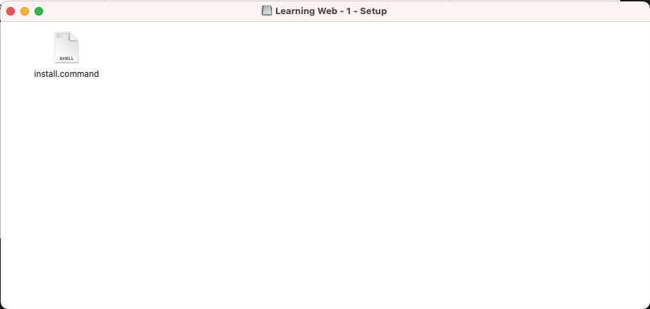
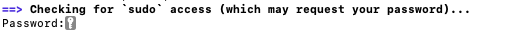
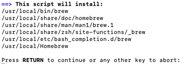
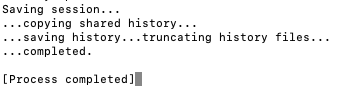

# Pre Lunch & Learn Install

## Install the script
- In the invitation there is a file named `Learning Web - 1 - Setup.dmg`. Download the file and open it.


- Double click on the `install.command`.
- Type your macbook password to install the required packages.


- Press `return` to continue.


- When you see the following message, you can close the windows.



You can [Go Back](../README.md) to follow the next steps.

## What is the script doing?
### Install and update Homebrew
```
/bin/bash -c "$(curl -fsSL https://raw.githubusercontent.com/Homebrew/install/HEAD/install.sh)"
brew update
```
Homebrew is a free and open-source software package management system that simplifies the installation of software on Apple's operating system, macOS, as well as Linux.

### Install git
```
brew install git
```
Git is software for tracking changes in any set of files, usually used for coordinating work among programmers collaboratively developing source code during software development.

### Install node
```
brew install node
```
Node.js is an open-source, cross-platform, back-end JavaScript runtime environment that runs on the V8 engine and executes JavaScript code outside a web browser.

### Clone/Open the project
Creating a folder in `~/lunch-and-learn/learning-web/1-basic-html-css`, cloning the project and opening VSCode.
